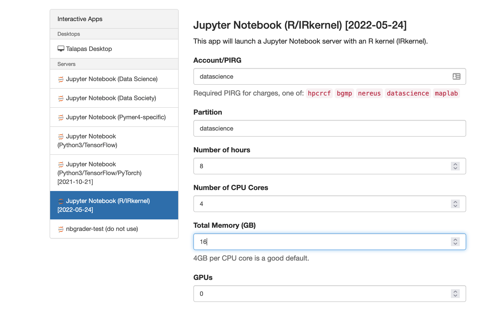

# Open On Demand on Talapas
---
We'll be working with data and computer that are part of UO's high-performance computing center [RACS](https://racs.uoregon.edu/)


---
# Connect to Open On Demand on Talapas
## Open On Demand is an easy way to access these resources through a web browser
---


* Use **Chrome** or **Firefox** (results may vary with other browsers)
Navigate to [talapas-ln1.uoregon.edu](https://talapas-ln1.uoregon.edu)
* Log in with your duckID credentials
* Select Interactive Apps in the top bar
* Click on **Jupyter Notebook (R/IRkernel)**
* You should see a form like this



### Use the following values

* Account = datascience
* Partition = datascience
* Number of hours = 8
* Number of CPU cores = 4
* Total Memory = 16
* GPU = 0

Leave Everything else blank

* Click Launch
* Wait and click connect!


## Grab Course Material
 * Click File > New > Terminal
 * Copy and paste the below into your terminal and hit enter (only need to do this once)
 ```bash
cp -r /projects/datascience/shared/Data4ML1/ ~/
``` 
